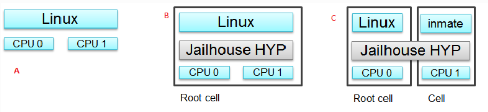

# Approfodimento sull'hypervisor Jailhouse su scheda NVIDIA Jetson TX2
**Jailhouse è un hypervisor di partizionamento statico basato su Linux**, sviluppato come progetto software GPLv2 gratuito. Esso è  in grado di eseguire applicazioni o sistemi operativi completi oltre a Linux. 
Jailhouse non virtualizza risorse che non  esistono ma si limita a suddividere le risorse hardware esistenti in compartimenti isolati chiamati **"celle"**, interamente dedicati a programmi software guest chiamati **"inmate"**. 
Una di queste celle esegue il sistema operativo Linux ed è nota come **"root-cell"**, le altre celle prendono in prestito CPU e dispositivi dalla cella principale man mano che vengono create.

L'immagine mostra:
**A)** Architettura di un sistema prima che Jailhouse venga installato
**B)** L'architettura con Jailhouse attivo
**C)**  L'architettura dopo la creazione di una cella

Jailhouse è un esempio di architettura **AMP** (Asynchronous Multiprocessing). 
Quando si avvia Linux su dispositivi con cluster di CPU ARM, Linux utilizza tutti i core, dopo aver abilitato l'hypervisor, Linux viene spostato nella cella root la quale utilizza ancora tutti i core della CPU. 
Quando viene create una nuova cella, l'hypervisor chiama *cpu_down()* per alcuni core mettendoli offline. 
La nuova cella utilizzerà questi core della CPU e le risorse hardware dedicate a questa cella nel file di configurazione della cella stessa.
Ogni cella esegue un guest e ha un insieme di risorse assegnate (CPU, regioni di memoria, dispositivi PCI) che controlla completamente. Il compito dell'hypervisor è quello di gestire le celle e mantenere il loro isolamento reciproco, dunque non potranno condividere le CPU, dato che l'hypervisor non prevede nessuno scheduler, ma potranno utilizzare segmenti di memoria condivisa.

Lo scopo del nostro progetto era quello di approfondire lo studio su Jailhouse testando le sue funzionalità su una [scheda NVIDIA Jetson tx2](https://www.nvidia.com/it-it/autonomous-machines/embedded-systems/jetson-tx2/#:~:text=Jetson%20TX2%20is%20a%207.5,GB%2Fs%20of%20memory%20bandwidth.) creando un'applicazione Bare-Metal in grado di comunicare con la cella principale. 
Nei successi paragrafi daremo una relazione dettagliata su tutti i passaggi da eseguire al fine di replicare correttamente gli esperimenti svolti. 

## Setup 
Per l'installazione del sistema operativo sulla scheda Jetson TX2 è necessario un pc con Linux Ubuntu 16.04 o 18.04 (può essere utilizzata una versione live avviata da usb per evitare l'installazione su pc, in questo caso sarà necessaria una memoria esterna abbastanza capiente (almeno 64 GB liberi consigliati) per i file temporanei utilizzati durante l'installazione.

Il primo passo è quello di scaricare ed installare l' [NVIDIA SDK Manager](https://developer.nvidia.com/nvidia-sdk-manager) che offre una soluzione di configurazione dell'ambiente di sviluppo end-to-end per gli SDK NVIDIA DRIVE, sia per i dispositivi host che per quelli target.

Una volta effettuato l'accesso con un account NVIDIA developer occorre seguire tutti gli step di installazione come descritto dalla seguente [guida](https://docs.nvidia.com/sdk-manager/install-with-sdkm-drive/index.html), nel nostro caso è stata selezionata una scheda **Jetson TX2** come dispositivo hardware e un sistema operativo linux con kernel 4.4 (**L4T 28.2.1**).
Al termine dell'installazione si avvierà il sistema operativo Ubuntu 16.04 sulla Jetson TX2, e dopo aver effettuato la configurazione di base si può procedere.

## Installazione hypervisor
A questo punto è necessario seguire la guida su GitHub fornita da [Evidence](https://github.com/evidence/linux-jailhouse-jetson).

### Compilazione kernel Linux

Come suggerito, per installare Jailhouse è necessaria una copia compilata del kernel Linux. 
La versione sorgente del kernel deve corrispondere alla versione del firmware flashato sulla Jetson. 

**N.B**: La guida su GitHub fornisce il link per il download dell'ultima versione del kernel, non compatibile con la nostra.

La guida di Evidence fa riferimento ad un'altra [repository](https://github.com/jetsonhacks/buildJetsonTX2Kernel) contenente degli scripts che facilitano la compilazione del kernel Linux specifico per le schede NVIDIA TX1 e TX2. C'è da fare attenzione nello scaricare gli script dalla release che fa riferimento alla corretta versione di L4T installata, nel nostro caso la [**28.2.1**](https://github.com/jetsonhacks/buildJetsonTX2Kernel/archive/refs/tags/vL4T28.2.1.zip).

In particolare nel file zip troviamo una serie di script bash che permettono di effettuare il download, la compilazione e l'installazione dei sorgenti kernel che poi saranno necessari alla compilazione dei sorgenti dell'hypervisor. (Per il download abbiamo utilizzato lo script in versione NoGUI che usa delle configurazioni predefinite che si sono rivelate funzionanti).

### Configurazione sistema

Prima di proseguire con la costruzione e l'installazione di Jailhouse, come indicato dalla guida, è necessario riservare una porzione contigua di RAM per Jailhouse e ogni altra cella. 
Attualmente questa deve essere pre-allocata durante l'avvio è quindi necessario modificare gli argomenti di avvio del kernell file **/boot/extlinux/extlinux.conf** : 
>`mem=7808M vmalloc=512M` 

Un altro passaggio preliminare è la configurazione dell'uscita seriale hardware per il debugging di Jailhouse. Per fare ciò, nello stesso file extlinux.conf, nella riga 
> `APPEND ${cbootargs} quiet root=/dev/mmcblk0p1 rw rootwait rootfstype=ext4 console=ttyS0,115200n8 console=tty0 OS=l4t fbcon=map:0 net.ifnames=0`

sostituire tutto ciò che segue la parola "APPEND" con l'output del comando da eseguire nel terminale
> `cat /proc/cmdline`

A questo punto identificare ed eliminare tutte le ripetizioni del parametro:
> `console=ttyS0,115200n8`

Salvare il file e riavviare per procedere con l'installazione di Jailhouse.

### Compilazione Jailhouse
Posizionarsi nella cartella del repository di evidence linux-jailhouse-jetson ed eseguire i comandi
> - `sudo make`
> - `sudo make install`

## Comandi CLI per l'uso dell'hypervisor
 In questa sezione vengono descritti i comandi principali forniti con il modulo per il suo funzionamento.
 1. **enable**: questo comando è necessario per l'abilitazione dell'hypervisor. Una volta lanciato il comando da linux (da eseguire come utente root) viene abilitato l'hypervisor e, come descritto in precedenza, viene generata la *root cell* a cui viene assegnato tutto l'hardware descritto nel file con estensione .cell il cui path viene passato come parametro al comando stesso. Successivamente alla generazione della cella viene (contententeautomaticamente) caricato il sistema operativo nella stessa. *Nota: il file di configurazione dipende ovviamente dall'hardware che si sta utilizzando.*
> `sudo jailhouse enable /path/to/config.cell`
2. **cell create**: questo comando viene utilizzato per creare una cella su cui caricare successivamente dei file binari che verranno eseguiti bare-metal. Anche questo comando necessita di un parametro contenente il path al file .cell di configurazione della cella stessa. Esattamente come per la root cell questo file dovrà contenere una descrizione delle risorse che verranno assegnate alla cella che verrà generata dal comando. Questo file contiene inoltre il nome che verrà assegnato alla cella come identificatore univoco. *Nota: i file con estensione .cell vengono generati dalla compilazione di file c. N, nei paragrafi successivi vengono descritte le modalità di scrittura e successiva compilazione di questi file.*
> `jailhouse cell create /path/to/config.cell`
3. **cell load**: una volta creata una cella le vengono riservate le risorse descritte che restano inutilizzate fino al caricamento e successiva inizializzazone di file eseguibili dalla macchina. Tramite il comando cell load è possibile caricare un file binario all'interno di una cella. Il comando necessita di conseguenza, come parametri, del nome della cella in cui caricare il file e del path al file stesso.
> `jailhouse cell load id-cell_ida /path/file/eseguibile.bin`
4. **cell start**: una volta caricato il file all'interno di una cella è necessario eseguire questo comando per lanciarne l'esecuzione. Il comando accetta l'identificatore della cella come parametro.
> `jailhouse cell start cell_id`
5. **cell stop**: viene utilizzato per fermare l'esecuzione di una cella.
6. **cell list**: viene utilizzato per ottenere una lista di tutte le celle attive e attualmente gestite dall'hypervisor. In output viene mostrata anche la cella principale.
7. **cell stats**: mostra in output varie statistiche associate alla cella richiesta.
8. **disable**: viene utilizzato per rilasciare tutte le risorse e disabilitare l'hypervisor tornando alla esecuzione "normale" del sistema operativo linux di partenza.

Per ulteriori approfondimenti rimandiamo al [manuale ufficiale](https://rtime.ciirc.cvut.cz/~sojka/students/F3-BP-2016-Baryshnikov-Maxim-barysmax_bachelor.pdf) in cui vengono approfonditi tutte le possibilità dell'hypervisor (sezione 2 per una descrizione degli altri comandi).

## Demo
In questa sezione una breve descrizione delle demo fornite con la repository github per progetto.
Una volta effettuato il riavvio della scheda è possibile **abilitare Jailhouse** attraverso i seguenti comandi:
 > - `sudo modprobe jailhouse`
 > - `sudo jailhouse enable [JAILHOUSE_REPO_PATH]/configs/arm64/jetson-tx2.cell`

Successivamente è possibile creare una cella, insieme alla root cell, in grado di eseguire una semplice applicazione Bare-Metal fornita dal repository.

Per prima cosa occorre creare la cella con il seguente file di configurazione in cui verranno riservati 1 CPU, 64Mb di RAM e definiti gli indirizzi delle varie regioni di memoria:
> - `sudo jailhouse cell create [JAILHOUSE_REPO_PATH]/configs/arm64/jetson-tx2-demo.cell`

Caricare uno dei programmi demo Bare-Metal presenti nella cartella */inmates/demos/arm64* all'interno della cella creata, nel nostro caso l'applicazione programmerà un interrupt periodico del timer, misurando il jitter e visualizzando il risultato sulla console:
> `sudo jailhouse cell load jetson-tx2-demo [JAILHOUSE_REPO_PATH]/inmates/demos/arm64/gic-demo.bin`

Ed infine avviare la nuova cella:
> `sudo jailhouse cell start jetson-tx2-demo`

Dopo la creazione attraverso i nomi o gli ID assegnati alle celle è possibile ottenere informazioni e statistiche attraverso i seguenti comandi: 
> `jailhouse cell list`
> `jailhouse cell stats [ID or cell_name]`

Per poter eliminare una cella e disabilitare Jailhouse è necessario eseguire:
> `sudo jailhouse cell destroy [ID or cell_name]`
> `sudo jailhouse disable`

## Celle ed applicazioni custom
L'idea del progetto è quella di sviluppare un'applicazione da far girare in una cella Jailhouse in ambiente bare-metal, ovvero senza sistema operativo Linux, in modo da avere accesso diretto alle periferiche hardware, ma mantenendo grazie all'hypervisor la possibilità di comunicare con la cella root, ovvero quella che continua a far girare Linux.
### Creazione di una cella custom
Il primo passaggio è quello di creare un file di configurazione per una cella. Il file è un sorgente C che va posizionato nel percorso:
> `[JAILHOUSE_REPO_PATH]/configs/[ARCHITECTURE]`

In tale percorso sono già presenti sia le celle root sia delle celle di esempio bare-metal per svariate board, compresa la Jetson TX2 (in `arm64`).
#### Studio cella root
Il punto di partenza è lo studio della cella root, ovvero il file, nel caso della Jetson TX2 
> `[JAILHOUSE_REPO_PATH]/configs/arm64/jetson-tx2.c`

n questo file viene definita una *struct* in linguaggio C, composta da un header, da un array delle regioni di memoria, uno dei chip di interrupt e uno dei device PCI.
In seguito alla definizione della struct essa viene subito istanziata con il nome *config* e vengono assegnati tutti i valori manualmente.
La parte più importante è probabilmente la definizione dell'array delle regioni di memoria, dove si vanno a definire i *mapping* tra indirizzi di memoria fisici (hardware) e virtuali (inmate cella).

#### Studio cella esempio (bare metal)
L'altro file fornito nel caso della Jetson TX2 è una cella di esempio:
> `[JAILHOUSE_REPO_PATH]/configs/arm64/jetson-tx2-demo.c`

La struttura del file è la stessa rispetto alla cella root, ma la struct è molto meno complessa non venendo definite tutte le aree di memoria e i dispositivi non utilizzati dall'inmate.
L'array delle regioni di memoria ha solo 5 elementi:
- **UART**, ovvero l'area di memoria in cui è mappata la porta seriale, tramite la quale l'inmate potrà inviare messaggi di log;
- la **RAM**, ovvero la memoria che Jailhouse mette a disposizione all'applicazione (da notare infatti che viene mappata nell'indirizzo virtuale 0);
- la **communication region**, ovvero un'area di memoria condivisa tra l'hypervisor e la cella per la comunicazione tra di essi attraverso API specifiche di Jailhouse;
- due segmenti **IVSHMEM** di memoria condivisa, definiti come dispositivi PCI, che permettono la comunicazione tra celle distinte.

A seguire c'è la definizione di un chip di interrupt e poi di due dispositivi PCI che rappresentano le due aree di memoria IVSHMEM (da notare il campo `shmem_region` nel quale viene assegnato manualmente l'indice dell'area di memoria a cui il device fa riferimento rispetto all'array delle regioni di memoria).
#### Configurazione di una cella custom
Nel nostro caso abbiamo configurato una cella che permette l'accesso ai pin GPIO della scheda e alla UART e la comunicazione tra celle.
Per fare ciò abbiamo copiato la cella di esempio in un nuovo file (nello stesso percorso) andando ad aggiungere due aree di memoria:
- **GPIO_CTL** ovvero l'area che mappa il controller della perifericha GPIO per il controllo diretto dei pin;
- **PADCTL_A (PINMUX)** ovvero l'area che mappa il pin mux, che permette di associare al pin fisico una periferica (nel nostro caso GPIO, ma potrebbe essere I2C, SPI, ecc)
Abbiamo copiato le definizioni di tali regioni dal file di configurazione della cella root (jetson-tx2.c) aggiungendo il flag **`JAILHOUSE_MEM_ROOTSHARED`** per segnalare all'hypervisor che tale area di memoria sarà condivisa con la cella root.
E' stata modificata la **dimensione del vettore** nella definizione della struct, che da 5 elementi passa a **7**, e anche i valori dei campi **shmem_region** dei device PCI dato che avendo modificato il vettore sono cambiati gli indici delle regioni IVSHMEM (un approccio possibile può essere quello di aggiungere le configurazioni delle nuove aree **in coda** al vettore in modo da non modificare gli indici delle aree precedentemente definite).
#### Compilazione cella
Riposizionandosi nella root del repository git, rieseguire il comando
> `sudo make`

Verrà generato nella stessa cartella del sorgente un file con estensione *.cell* che dovrà essere indicato a jailhouse al momento della creazione della cella con il comando
> `sudo jailhouse cell create XXX.cell`
### Sviluppo di applicazioni Bare Metal
Per lo sviluppo dell'applicazione da far girare nella cella bare-metal abbiamo fatto riferimento agli esempi di inmates che possiamo trovare nella cartella:
>`[JAILHOUSE_REPO_PATH]/inmates/demos/arm`

I sorgenti C che troviamo in questa cartella sono poi compilati sia per l'architettura ARM che per quella ARM64 attraverso l'opportuna configurazione dei Makefile.
In particolare replicando il pattern presente per la compilazione degli esempi forniti, va aggiunta la voce relativa al nuovo sorgente C da compilare.

#### Librerie e API da usare
Lo sviluppo è in linguaggio C puro, non è possibile per ovvi motivi utilizzare le classiche librerie `std` o call di sistema Linux.
Jailhouse fornisce una libreria `inmate.h` che dà accesso a diverse funzioni, a questo avviso suggeriamo di studiare gli esempi e di esplorare la libreria osservando le funzioni presenti (sembra non essere presente una documentazione ufficiale).
In particolare viene fornita una funzione `printk` che, con la stessa sintassi della classica `printf` di `stdio.h`, permette di scrivere ad alto livello sulla porta seriale e quindi di avere un semplice strumento di logging.

Per l'accesso alle periferiche hardware mappate nella cella, è necessario utilizzare la seguente funzione per abilitare l'accesso alla regione di memoria (altrimenti Jailhouse rifiuta l'accesso e la cella va in errore):
`void  map_range(void *start, unsigned  long  size, enum  map_type  map_type)`

- come primo parametro va indicato l'indirizzo virtuale di base della regione, come mappato nella configurazione della cella;
-  il secondo parametro è la dimensione dell'area, anch'essa definita nella cella;
-  il terzo parametro può assumere due valori:
-- `MAP_UNCACHED`: adatto a regioni di memoria che mappano registri di periferiche hardware
-- `MAP_CACHED`: adatto a regioni di memoria classiche, utilizzate all'interno del programma per allocare dati.

Una volta creato il sorgente e aggiornato il Makefile, si può procedere alla compilazione eseguendo il comando 
> `sudo make`

dalla home del repository. Se la configurazione è corretta verrà generato il corrispondente file in formato `.bin` da passare alla cella creata con il comando
> `sudo jailhouse cell load [CELL_NAME] [JAILHOUSE_REPO_PATH]/inmates/demos/arm64/[ESEGUIBILE].bin`

### Sviluppo di codice C per la cella Linux
Nella cella root l'accesso alle periferiche hardware si può realizzare come su un sistema nativo senza hypervisor, ovvero sfruttando l'accesso diretto alla memoria (ad esempio usando la funzione `mmap` e l'accesso al file `/dev/mem` disponibile su Linux per ottenere un puntatore all'area di memoria registrata nella configurazione della cella), oppure utilizzando i driver Linux e quindi l'accesso ai file di device come ad esempio i vari `/dev/gpio`.
## Applicazione Demo
L'applicazione che abbiamo sviluppato è composta dalla cella bare-metal e da quella root con il sistema operativo Linux.
Nella cella bare-metal viene eseguito un inmate che configura un pin GPIO in output mode e lo controlla, basandosi sul valore che legge in una cella di memoria condivisa; viene inoltre utilizzato il logging su porta seriale.

Nella cella Linux viene eseguito un programma che periodicamente cambia il valore nella cella di memoria condivisa, andando quindi a controllare indirettamente l'output del pin GPIO.

Utilizzando il linguaggio [Go](https://go.dev/), che permette l'accesso diretto alla memoria tramite i puntatori e al contempo di utilizzare numerose librerie attraverso un package manager, abbiamo sviluppato un semplice server web che espone un API accessibile tramite GET request con la quale comandare il led. Il programma hosta una semplice pagina HTML con un bottone per effettuare la richiesta.
## Considerazioni finali e suggerimenti
Questo approccio è particolarmente utile per la virtualizzazione di attività che richiedono il pieno controllo della CPU; ne sono un esempio le attività di controllo in tempo reale e le operazioni di calcolo a lungo termine (high-performance computing). Oltre a questi, può essere utilizzato per applicazioni di sicurezza, ad esempio per creare sandbox.

Uno dei principale vantaggi è il non utilizzo di uno scheduler di allocazione delle risorse complesso, dato che l'assegnazione di un core CPU separato garantisce che non esegua altre attività.

Questo approccio ha la capacità di fornire un accesso garantito alle risorse e prestazioni prevedibili, rendendo Jailhouse una soluzione adatta per la creazione di attività in tempo reale. 

Da tener in considerazione anche gli svantaggi come la scalabilità limitata, che si basa sul numero di core della CPU, la necessità di un hardware in grado di offrire alte prestazioni e soprattutto la scarsa modularità e documentazione per l'implementazione di nuove applicazioni che necessitano la modifica e la ricompilazione di molteplici file di configurazione del progetto.

Abbiamo notato, seppur utilizzando una scheda come la Nvidia Jetson TX2 dotata di 8gb di ram e di una CPU quad core molto performante, che l'esecuzione di Jailhouse e di alcune semplici applicazioni portano a numerosi bug e glitch nel sistema Linux che spesso risultano in crash del sistema e degli applicativi in esecuzione.

Allo stato attuale dello sviluppo dell'hypervisor, visto lo stato ancora precario sotto il punto di vista della stabilità e la difficoltà nella compilazione delle applicazioni, rimane il dubbio sull'effettiva utilità di Jailhouse, visto che molti casi d'uso possono essere implementati direttamente in linux nativo attraverso opportuni driver hardware e sfruttando le patch real-time del kernel, oppure separando l'applicazione su un sistema con s.o. linux e un microcontrollore che gestisce la parte critica real time, comunicando attraverso i classici protocolli hardware come ad esempio UART/RS232/RS485.
